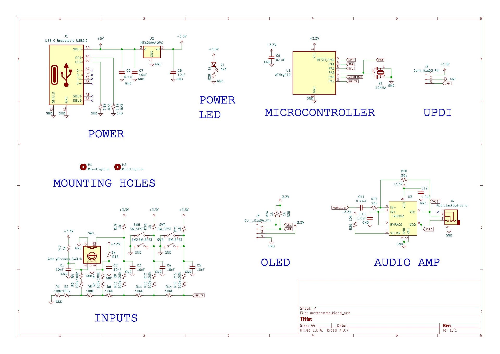
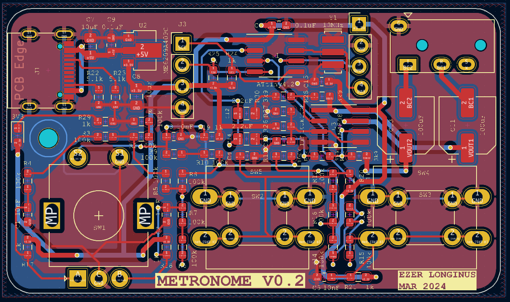

# ATTiny412 Metronome
ATTiny412 metronome build
This board is a simple metronome using the ATTiny 412 chip.  The interface includes two push buttons, one rotaty encorder with push button, I2C OLED breakout, and headphone amplifier.  The unit can be powered via a USB-C connector, and has a 6.35mm headphone jack for audio output.
There is also a breakout pins for the UPDI programming, and an additional pin out for the PA3 pin if an external clock source is not used.
The switch button footprints are to allow for either the 12mm or 6mm tactile push buttons.

## Purpose
I pretty much wanted an execuse to play around with the ATTiny Series 1 chips, and wanted to build a fairly simple project that would utilize some of the functionality of the chip.  My original intention was to try to build a fairly functional metronome for as little as possible in parts costs.  There are definitely some corners I could have cut further, but in the end I'm mostly just building it for me, so I don't have to go too wild on cost savings.  That said, I may end up revisiting this project and design this for production.  
Having a rotary encoder with a push button, two additional buttons, a headphone amp, and an I2C breakout does lend itself to other projects besides metronomes (obviously).  So this project may also end up being a testing bed for some other audio related projects I have in mind.

<<<<<<< HEAD
## Scematic

=======
## Schematic

>>>>>>> 66be742e4b5f0637ad32f0060c9d6ff2470e53f0

## Layout

## Updates & Fixes
### Version 2
* Changed out headphone amplilfier to LM4808
* Fixed 6.35mm headphone jack footprint
* Added pinout for PA3
* Staggered holes for UPDI for less permananet uploading
* Removed a mounting hole to allow for the DC blocking capacitors

